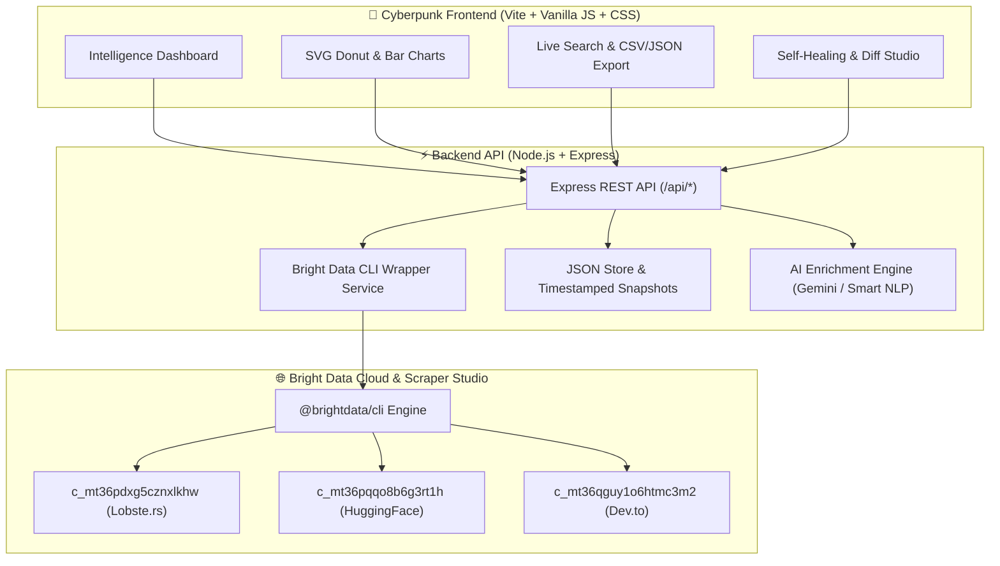

# ⚡ ScrapeVerse Pulse
> **AI-Powered Web Intelligence Dashboard with Self-Healing Scrapers**  
> *Built for the "Into the Scrape-Verse" Hackathon by WeMakeDevs & Bright Data.*

[](tests/api.test.js)
[](https://brightdata.com)
[](https://ai.google.dev)
[](LICENSE)

---

## 🌟 Overview

Web scraping traditionally suffers from **brittle selectors, silent data loss, and high maintenance costs** whenever websites redesign their HTML or modify class names.

**ScrapeVerse Pulse** solves this with a next-generation web intelligence platform powered by **Bright Data Scraper Studio CLI (`@brightdata/cli`)**, providing:
1. 🕷️ **Natural Language AI Scrapers:** Prompt-driven data collection targeting niche technical sources.
2. 🩹 **Zero-Downtime Self-Healing:** Automated in-place CSS selector repair when target DOM structures drift, preserving production Collector IDs.
3. 🧠 **AI Data Enrichment Pipeline:** Gemini 2.5 Flash integration (with offline NLP fallback) for automated executive summaries, domain taxonomy tagging, and impact ratings.
4. 📊 **Cyber Glassmorphic Dashboard:** Real-time visual analytics, SVG radial distribution charts, instant client-side search, and one-click JSON/CSV dataset exports.

---

## 🎯 Hackathon Tracks Addressed

ScrapeVerse Pulse was architected to compete across **all prize tracks**:

| Track | Focus | How ScrapeVerse Pulse Fulfills It |
| :--- | :--- | :--- |
| **Track 1: The Specialist** | Niche Website Scraper | Custom-built collectors for **Lobste.rs** (hacker news stories) and **HuggingFace Papers** (daily AI research) avoiding common mainstream sites. |
| **Track 2: The Multi-Scraper** | Multi-Source Platform | Orchestrates 3 concurrent collectors, unifying heterogeneous datasets into a single synchronized data feed and analytics hub. |
| **Track 3: The Self-Healer** | Self-Healing Scraper | Complete self-healing studio with simulated DOM drift, before/after selector diff inspection, and standalone verification (`scripts/demo-heal.js`). |
| **The Daily Bugle** | Community Engagement | Full demo script, architecture breakdown, and LinkedIn post ready for submission. |

---

## 🏗️ Architecture



---

## 🕷️ Provisioned Scrapers & Live Datasets

| Source | Collector ID | URL | Extracted Fields |
| :--- | :--- | :--- | :--- |
| **Lobste.rs** | `c_mt36pdxg5cznxlkhw` | `https://lobste.rs` | Story title, score, submitter, tags, comment count, product page URL |
| **HuggingFace** | `c_mt36pqqo8b6g3rt1h` | `https://huggingface.co/papers` | Paper title, authors list, abstract body, published date, arxiv link |
| **Dev.to** | `c_mt36qguy1o6htmc3m2` | `https://dev.to` | Article title, author name, reading time, reactions, tags |

---

## 🚀 Quickstart Guide

### Prerequisites
* **Node.js:** v18.0.0 or higher
* **Bright Data CLI:** Authenticated via `npx @brightdata/cli login` (or using existing session)

### 1. Clone & Install
```bash
git clone https://github.com/inusha-thathsara/ScrapeVerse-Pulse.git
cd ScrapeVerse-Pulse
npm install
```

### 2. Environment Configuration
Copy the template environment file:
```bash
cp .env.example .env
```
*(Optional: Add your `GEMINI_API_KEY` for cloud-based AI enrichment. If omitted, the built-in Smart Local NLP engine runs automatically).*

### 3. Run Automated Test Suite
```bash
npm test
```
*Executes all 11 unit/integration test suites verifying API health, collector schemas, JSON storage snapshots, and AI enrichment.*

### 4. Start the Application
```bash
npm run dev
```
* Spawns Express API on `http://localhost:3001`
* Spawns Vite Dashboard on `http://localhost:5173`

---

## 🩹 Self-Healing Scraper Demonstration

You can run the standalone self-healing CLI script to observe the AI repair cycle in terminal:

```bash
node scripts/demo-heal.js lobsters
```

### Self-Healing Lifecycle
```
1. 🔍 Anomaly Detection  ──> Detects missing selectors or null fields after site layout changes.
2. 🩹 AI Prompt Trigger  ──> Calls `bdata scraper heal <collector_id> "<prompt>"` with auto-approval.
3. ⚙️ In-Place Repair    ──> Scraper Studio updates CSS/XPath bindings in the cloud.
4. 🚀 Verification Run   ──> Re-executes scrape with 100% data fidelity & zero downstream downtime.
```

---

## 📂 Project Structure

```
Into the Scrape-Verse/
├── data/                      # Structured JSON datasets & timestamped snapshots
│   ├── lobsters/              # Lobste.rs dataset (latest.json + snapshots)
│   ├── huggingface/           # HuggingFace AI papers dataset
│   └── devto/                 # Dev.to articles dataset
├── scripts/
│   ├── demo-heal.js           # Standalone self-healing verification script
│   └── run-all.js             # Batch scraper executor
├── server/
│   ├── config/
│   │   └── scrapers.json      # Collector registry & status tracking
│   ├── routes/
│   │   ├── scraper.js         # Scraper control endpoints (run, heal, status)
│   │   └── data.js            # Data retrieval & AI enrichment routes
│   ├── services/
│   │   ├── brightdata.js      # Programmatic Bright Data CLI child process wrapper
│   │   ├── storage.js         # JSON storage layer with automated normalization
│   │   └── enrichment.js      # Gemini API + Smart Local NLP enrichment engine
│   └── index.js               # Express server entry point
├── src/
│   ├── css/
│   │   └── index.css          # Modern dark glassmorphism design system
│   └── js/
│       ├── api.js             # Type-safe frontend API client
│       ├── app.js             # Main view router, search filter, and UI logic
│       └── charts.js          # SVG Donut & Activity Bar charts
├── tests/
│   └── api.test.js            # Node native automated test suite (11/11 passing)
├── index.html                 # Semantic HTML entry point
├── package.json
└── vite.config.mjs
```

---

## 🧪 API Endpoints

### Scraper Control (`/api/scraper`)
* `GET /api/scraper` — List all registered collectors with dynamic record counts.
* `GET /api/scraper/:id` — Get detailed configuration for a collector.
* `POST /api/scraper/:id/run` — Trigger live scrape and persist timestamped snapshot.
* `POST /api/scraper/:id/heal` — Trigger AI self-healing selector repair.

### Data & Intelligence (`/api/data`)
* `GET /api/data` — Summaries of all data sources with record counts.
* `GET /api/data/:sourceId` — Latest extracted dataset for a source.
* `GET /api/data/:sourceId/snapshots` — List immutable historical snapshots.
* `POST /api/data/:sourceId/enrich` — Enrich dataset with AI summaries and category tags.

---

## 🛡️ License

Distributed under the **MIT License**. See `LICENSE` for more information.

---

*Developed with ⚡ by [Inusha Thathsara](https://github.com/inusha-thathsara) for Into the Scrape-Verse Hackathon 2026.*
